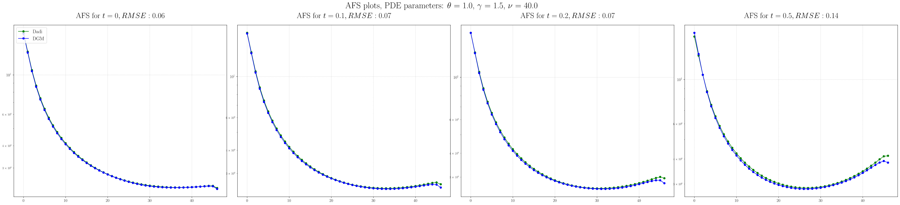
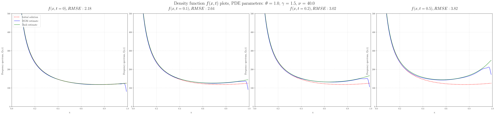

# Deep Galerkin Method for predicting demographic history of populations

*Bioinformatics Institute, 2020, spring*

## Project goals

The aim of the project was to introduce the method for solving differential equations using [Deep Galerkin](https://arxiv.org/pdf/1909.11544.pdf) neural networks into the dadi method for solving the diffusion equation. Since the [Diffusion Approximations for Demographic Inference [dadi]](https://github.com/niuhuifei/dadi) method simulates genetic data, namely the allele-frequency spectrum (AFS), numerically solving several diffusion equations. 

It is proposed to solve the following equation using Deep Galerkin:  
  
with boundary condition:  


where *S* is selection coefficient,  is relative population size and  is influx of new mutations coefficient.  

The solution u(x,t) of this equation is the density of the allele-frequency spectrum. With it, it is possible to evaluate the parameters of the demographic history of populations using the maximum likelihood method.

## Methods

The implementation from the original article of [Deep Galerkin](https://arxiv.org/pdf/1909.11544.pdf) was used with some changes. The Deep Galerkin method was applied for the one-dimensional diffusion equation with the following parameters: selection, relative population size and mutation influx. We also implemented training with different sets of parameters, which allowed us to train the model once, and use it further with different parameters without re-training.


## Results

We obtained almost identical solution with dadi method for AFS with RMSE less than 1 on average. We have not obtained the desired acceleration, because model training is slow. However it seems that for large dimensions, the method based on neural networks should give on orders of magnitude better result than the classical methods for solving differential equations, and in particular, the diffusion equation.

From the application of our method we can get the following result, for example:




# Startup instructions

## Requirements

Python >= 3.7

(Tested on Ubuntu 18.04, Python 3.7)

## How to run

### Dependencies

We recommend using a virtual environment to eliminate dependency errors.

```
pip install -r requirements.txt
```

to install dependencies.

### Running

Run `model_train.py` to train a new model to solve the diffusion equation. The trained model will be stored in "trained_models" folder.
There are no parameters to set in CLI. You can change the range of parameters of equation and training settings by editing the source code.  
**You can change the following parameters:**  


#### PDE parameters domain:  
  * nu_low and nu_high: range of values for a relative population size  
  * gamma_low and gamma_high: range of values for a selection coefficient  
  * theta_low and theta_high: range of values for the influx of new mutations coefficient  
  
  Large range of values for parameters require more iterations of training, but it will give you a more versatile model, that can be used with wider domain of parameters.  
  
#### Neural network architecture parameters:  
  * num_layers: the number of layers  
  * nodes_per_layer: the number of neurons in the layer    
#### Training parameters:  
  * learning_rate: the step size at each iteration of gradient descent  
  * sampling_stages: the number of times to resample new time-space domain points  
  * steps_per_sample: the number of stochastic gradient descent steps to take before re-sampling  
  * nSim_interior: size of samples from time-space domain and parameters domain  
    
You can use an already trained model that is saved in a folder ```trained_models```. The example of its use and comparison with the classical solution is in ```one_pop_example.ipynb``` notebook.


