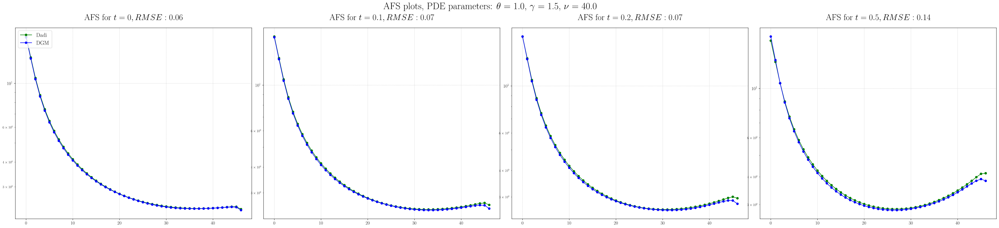
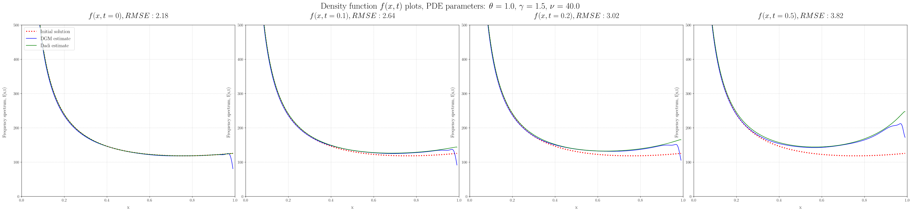

# Deep Galerkin Method for predicting demographic history of populations

*Bioinformatics Institute, 2020, spring*

## Project goals

The aim of the project was to introduce the method for solving differential equations using [Deep Galerkin](https://github.com/analysiscenter/pydens) neural networks into the dadi method for solving the diffusion equation. Since the [Diffusion Approximations for Demographic Inference [dadi]](https://github.com/niuhuifei/dadi) method simulates genetic data, namely the allele-frequency spectrum (AFS), numerically solving several diffusion equations. 

## Methods

The implementation from the original article of [Deep Galerkin](https://arxiv.org/pdf/1909.11544.pdf) was used with some changes. The Deep Galerkin method was applied for the one-dimensional diffusion equation with the following parameters: selection, relative population size and mutation influx. We also implemented training with different sets of parameters, which allowed us to train the model once, and use it further with different parameters without re-training.

## Results

We obtained almost identical solution with dadi method for AFS with RMSE less than 1 on average. We have not obtained the desired acceleration, because model training is slow. However it seems that for large dimensions, the method based on neural networks should give on orders of magnitude better result than the classical methods for solving differential equations, and in particular, the diffusion equation.

From the application of our method we can get the following result, for example:




# Startup instructions

## Requirements

Python >= 3.7

(Tested on Ubuntu 18.04, Python 3.7)

## How to run

### Dependencies


Install ...

```
pip install -r requirements.txt
```

to install dependencies.

### Running

Run `model_train.py ...` to train a new model to solve the diffusion equation. You can specify range of parameters in the source code.
You can use an already trained model that is saved in a folder ```trained_models```. An example of its use and comparison with the classical solution is in ```one_pop_example.ipynb``` notebook.

There are no parameters to set in CLI. You can change the program by editing the source code.

#### Clarification

Scripts (`file_1.py`, `file_2.py`, ...) do this...
